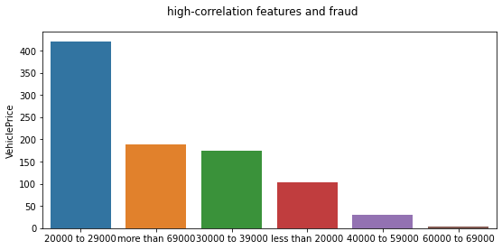
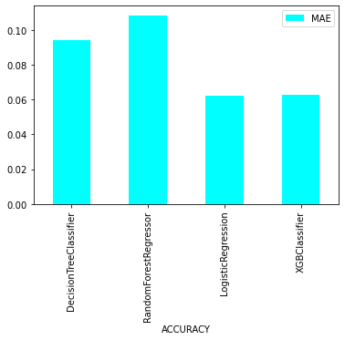

# Machine-learning-classifications-fraud-detection

As part of data analysis, we can see the correlation between car price and fraud:

mean absolute error of dufferent models have been copmared:

The data of this work can be found in the following link:

https://www.kaggle.com/datasets/shivamb/vehicle-claim-fraud-detection

`DISCLAIMER`:  I don't warrant this code in any way whatsoever. This code is provided "as-is" to be used at your own risk.
